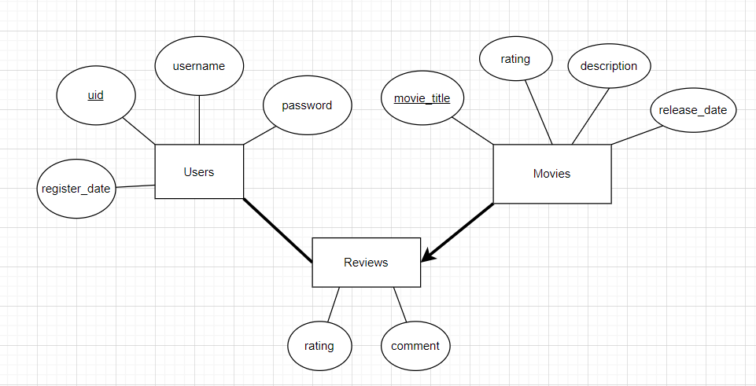

# 1. 1.2 节 SQL 的查询部分，23467 题的查询代码

2. 返回所有名字以 S 开头的船员

```sql
SELECT sid, sname FROM sailors
WHERE sname LIKE 'S_%';
```

3. 输出 Sailors 中年龄大于等于 29 的船员，输出他们的名字，并按他们的 rating 降序排序，仅输出前两个

```sql
SELECT sname
FROM Sailors
WHERE age >= 29
ORDER BY rating DESC
LIMIT 2;
```

4. 找到 rating 比 sid 为 7 的船员高的船员，返回他们的 age 除以 rating 的值

```sql
SELECT sname, age / rating AS age_per_rating
FROM Sailors
WHERE rating > (SELECT rating FROM Sailors WHERE sid = 7);
```

6. 返回预订过所有船的船员

```sql
SELECT s.sid, s.sname
FROM Sailors s
WHERE NOT EXISTS (
    SELECT 1
    FROM Boats b
    WHERE NOT EXISTS (
        SELECT 1
        FROM Reserves r
        WHERE r.sid = s.sid AND r.bid = b.bid
    )
);
```

7. 将 Sailors 中的船员按 rating>5 和 rating<=5 分成两组，分别返回他们的年龄的平均值。 用 CREATE VIEW 去重新实现上面的第二个例子的写法。

```sql
CREATE VIEW high_low_rating_avg_age AS
WITH high_rating AS (
    SELECT AVG(age) AS avg_age
    FROM Sailors
    WHERE rating > 5
),
low_rating AS (
    SELECT AVG(age) AS avg_age
    FROM Sailors
    WHERE rating <= 5
)
SELECT
    (SELECT avg_age FROM high_rating) AS high_rating_avg_age,
    (SELECT avg_age FROM low_rating) AS low_rating_avg_age;
```

# 2. 1.3 节

```sql


CREATE TABLE time_slot (
    slot_id CHAR(1),
    date_day day,
    start_hour INT,
    start_minute INT,
    end_hour INT,
    end_minute INT
);

CREATE TABLE classroom (
    building_name CHAR(100),
    room_number INT,
    capacity INT
);

CREATE TABLE department (
    department_name CHAR(100),
    head_of_department CHAR(100),
    budget DECIMAL(10, 2)
);

CREATE TABLE course (
    course_id CHAR(10) PRIMARY KEY,
    course_name CHAR(100),
    department CHAR(50),
    credits INT
);

CREATE TABLE instructor (
    instructor_id CHAR(5) PRIMARY KEY,
    name CHAR(100),
    department CHAR(50),
    salary DECIMAL(10, 2)
);

CREATE TABLE section (
    section_id CHAR(10) PRIMARY KEY,
    course_id CHAR(5),
    semester CHAR(10),
    date_year YEAR,
    building CHAR(50),
    room_number CHAR(5),
    instructor_id CHAR(5)
);

CREATE TABLE student (
    student_id CHAR(10) PRIMARY KEY,
    student_name CHAR(100),
    department_name CHAR(100),
    age INT
);

CREATE TABLE takes (
    student_id CHAR(10),
    course_id CHAR(10),
    section_id CHAR(10),
    semester CHAR(10),
    date_year YEAR,
    grade CHAR(2),
    PRIMARY KEY (student_id, course_id, section_id, semester, date_year)
    FOREIGN KEY (student_id) REFERENCES student(student_id),
    FOREIGN KEY (course_id) REFERENCES course(course_id),
    FOREIGN KEY (section_id) REFERENCES section(section_id),
);

```

# 3. 2.1 节 E-R Model 部分, Weak Entity 的 Table 建立代码

```sql
CREATE TABLE  Policy (
    ssn CHAR(10),
    pname CHAR(10),
    cost INT,
    PRIMARY KEY (ssn, pname),
    FOREIGN KEY (ssn) REFERENCES employees(ssn),
    FOREIGN KEY (pname) REFERENCES dependents(pname)
)

```

# 4. 答案 : A, A

# 5. 任务 3

1. 数据库的 E-R 图和数据库建立的代码



```sql

CREATE TABLE users(
    uid CHAR(10) PRIMARY KEY,
    username CHAR(50),
    password CHAR(50),
    register_date DATE
);

CREATE TABLE movies(
    movie_title CHAR(100) PRIMARY KEY,
    release_date DATE,
    rating INT,
    description TEXT,
);


CREATE TABLE reviews(
    uid CHAR(10),
    movie_title CHAR(100),
    rating INT,
    comment TEXT,
    PRIMARY KEY (uid, movie_title),
    FOREIGN KEY (uid) REFERENCES users(uid),
    FOREIGN KEY (movie_title) REFERENCES movies(movie_title)
);
```

2. 插入一些数据代码

```sql
INSERT INTO users (uid, username, password, register_date)
VALUES
    ('U001', 'john_doe', 'password123', '2024-01-15'),
    ('U002', 'jane_smith', 'password456', '2024-02-20'),
    ('U003', 'alice_williams', 'password789', '2024-03-10'),
    ('U004', 'bob_johnson', 'password000', '2024-04-05');

INSERT INTO movies (movie_title, release_date, rating, description)
VALUES
    ('The Matrix', '1999-03-31', 8, 'A computer hacker learns from mysterious rebels about the true nature of his reality and his role in the war against its controllers.'),
    ('Inception', '2010-07-16', 9, 'A skilled thief who steals secrets through the use of dream-sharing technology is given a chance to have his criminal record erased if he can successfully perform an inception.'),
    ('The Dark Knight', '2008-07-18', 9, 'When the menace known as The Joker emerges from his mysterious past, he wreaks havoc and chaos on the people of Gotham.'),
    ('Avatar', '2009-12-18', 7, 'A paraplegic Marine dispatched to the moon Pandora on a unique mission becomes torn between following his orders and protecting the world he feels is his home.');

INSERT INTO reviews (uid, movie_title, rating, comment)
VALUES
    ('U001', 'The Matrix', 9, 'Amazing plot and special effects! A must-watch for sci-fi fans.'),
    ('U002', 'Inception', 10, 'Incredible concept and execution. One of the best movies ever made!');
    ('U003', 'Interstellar', 8, 'Great movie, but the pacing felt a little slow at times.'),
    ('U004', 'The Dark Knight', 10, 'Heath Ledgers performance as the Joker is legendary. Best superhero movie of all time!'),
    ('U001', 'Avatar', 7, 'Visually stunning but the plot felt too predictable. Still a solid movie.'),
    ('U002', 'The Matrix', 8, 'Great movie, though I found some parts a bit hard to follow.'),
    ('U003', 'Avatar', 6, 'The visuals were incredible, but the story did not live up to the hype for me.');
```

3. 写几个有意义的查询语句，并展示这些查询语句的效果

- 查询用户 U001 的评论

```sql
SELECT *
FROM reviews
WHERE uid = 'U001'; -- 会显示两个评论， Avatar 和 The Matrix 电影
```

- 查询评分大于等于 9 的电影

```sql
SELECT *
FROM reviews
WHERE rating >= 9; -- 会显示3个评论: The Matrix, Inception, The Dark Knight
```

- 查询 "Avatar" 电影的平均分

```sql
SELECT AVG(rating) AS average_rating
FROM reviews
WHERE movie_title = 'Avatar'; -- 会显示 6.5000
```
